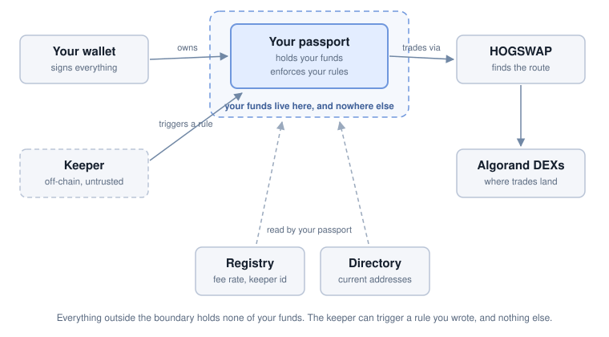

# DeFi Passport

**Non-custodial automated trading on Algorand - by LiquiHog**

DeFi Passport lets you automate a trading strategy without giving up custody of
the funds it trades. You deploy your own smart contract - your passport - fund
it, and define the rules you want followed. An off-chain keeper executes those
rules on your behalf. It never holds your funds, never writes your rules, and
can only do what your rules already permit.

---

## Why DeFi Passport?

Automating a strategy normally means one of two things: depositing into a pooled
contract someone else controls, or handing an API key to a bot that can withdraw.
Both replace market risk with counterparty risk. If the operator is compromised,
careless, or dishonest, the funds are gone regardless of how the strategy
performed.

A passport removes that trade-off. The contract is yours - deployed by you, owned
by your address. Every method that moves value checks that the caller is the
owner. The automation runs outside it and holds no authority over your balance.
All it can do is trigger a rule you already wrote, within bounds you already set.

The worst a misbehaving keeper can do is execute a trade you defined, at or
better than the price you set. It cannot withdraw, cannot invent a trade, and
cannot edit your rules.

## How It Works

1. **Deploy your passport.** A smart contract owned by your address. It is
   registered at creation so the automation can find it.
2. **Fund it.** Send ALGO and any assets you want to trade. Deposits are
   ordinary transfers - no approval to grant, no allowance to revoke.
3. **Define rules.** A rule states what to trade, how much, how often, and the
   price you will not accept worse than. Funds a rule needs are reserved for it
   and cannot be spent by anything else.
4. **The keeper executes.** When a rule comes due, the keeper triggers it. The
   contract checks the trade against the rule's own terms before anything moves.
   If the trade does not satisfy them, it does not happen.

You can change or cancel a rule at any time, withdraw anything that is not
reserved, and close the passport entirely whenever you want.

## Key Features

### Custody and control

| Feature | Description |
|---|---|
| **Your own contract** | One passport per owner, deployed by you. No shared pool, no other users' positions in the same balance |
| **Owner-gated** | Every method that moves value requires your signature - deposits, withdrawals, rules, positions, upgrades, closure |
| **No withdrawal authority** | The keeper can trigger rules. It cannot withdraw, opt out of an asset, or change a rule |
| **Reserved funds** | Funds committed to a rule cannot be withdrawn or spent by another rule until you release them |
| **Opt-in upgrades** | Only you can update your passport's code. Nobody can push a change to it, and a downgrade is refused |
| **Exit is never gated** | Closing your passport and reclaiming everything is always available |

### Strategies

| Feature | Description |
|---|---|
| **Four strategy types** | Scheduled buys, limit orders, grid, and a portfolio balancer |
| **On-chain price protection** | Every rule carries a bound the contract enforces at execution - a fill that does not meet it is refused |
| **Many rules per strategy** | A strategy is a container; a grid's cells or a balancer's assets are rules inside it |
| **Live editing** | Re-price or re-fund a running rule without cancelling it |
| **Positions** | Set an asset aside so neither you nor a strategy spends it by accident |

### Automation and fees

| Feature | Description |
|---|---|
| **0.05% keeper fee** | Charged on the output of an automated fill. A swap you trigger yourself pays none |
| **0.05% routing fee** | HOGSWAP's fee on the output of any swap, falling to zero as your passport's HOG holding rises to 100 HOG |
| **Exact-cost gas** | The keeper reclaims precisely what the trigger transaction cost it from a reserve you fund, and no more |
| **Fails safe** | If your gas reserve empties or the keeper stops, rules stop being triggered. They do not fill badly |

## Strategies

| Strategy | Tier | What it does |
|---|---|---|
| **[Scheduled buys](docs/strategies/dca.md)** | Public | Trade a fixed amount on a fixed interval - dollar-cost averaging, in either direction |
| **[Limit orders](docs/strategies/limit-orders.md)** | Public | Trade a fixed amount only at or better than a price you set, with optional partial fills and expiry |
| **[Grid](docs/strategies/grid.md)** | Beta | Price cells that buy low, sell high, and re-arm themselves. No oracle involved |
| **[Balancer](docs/strategies/balancer.md)** | Beta | Hold a set of assets at target values and trade back toward them when they drift |

## Tiers

Two builds of the same contract, from one source. The public build is the
smaller surface; the beta build adds the two strategies that carry more
configuration and more ways to set it wrong.

| Tier | Version | Strategies | Availability |
|---|---|---|---|
| **Public** | v1.0.0 | Scheduled buys, limit orders | Open to any Algorand address |
| **Beta** | v1.1.0 | All four | Allowlisted addresses only |

Both are the same line, so moving from public to beta is an in-place upgrade -
nothing migrates and no funds move. See [Tiers](docs/core/tiers.md) for how to
ask about beta access.

## What It Costs

Two fees, both charged on the **output** of a trade:

| Fee | Rate |
|---|---|
| HOGSWAP routing fee | 0.05%, falling linearly as your passport's HOG holding rises, reaching **zero at 100 HOG** |
| Keeper fee | 0.05%, flat, on automated fills only |

So an automated fill costs up to 0.10% of what it produces, and 0.05% once your
passport holds 100 HOG. A swap you trigger yourself pays no keeper fee, and
nothing at all at 100 HOG.

Separately, your passport needs some ALGO. Algorand charges every account a
minimum balance for the contract itself, for each asset it holds, and for each
rule it stores, and the keeper reclaims its transaction costs from a reserve you
fund. The minimum-balance portion is not spent - it is released back to you when
you close the passport. See [Fees and costs](docs/reference/fees-and-costs.md).

## Architecture Overview

Your passport holds your funds and enforces your rules. It executes swaps
through **HOGSWAP**, LiquiHog's in-house route aggregator, which finds a route
across Algorand's DEXs. The **registry** is where your passport registers so the
automation can find it, and it publishes the fee rate and the keeper's identity.
The **directory** publishes the current addresses of the contracts your passport
uses, so those can be replaced without you needing a new passport - and your
passport only adopts a change when you ask it to.

The **keeper** sits outside all of it. It watches for rules that are due and
triggers them. It is not a party to your balance.

## Getting Started

The app is at **[app.liquihog.com](https://app.liquihog.com)**. Create a
passport, fund it, opt into the assets you want to trade, set aside some ALGO
for automation, and add your first rule.

Everything the app does can also be done directly against the contracts. See
[Getting started](docs/guides/getting-started.md) for the sequence and why the
order matters, and [Developer tools](docs/reference/developer-tools.md) for the
SDKs, the HOGSWAP API, and the MCP server.

The two on-chain ids you need:

| | App id |
|---|---|
| Directory | `3670912562` |
| Registry | `3672932347` |

Verify the creator address of the directory before trusting what it publishes.
See [On-chain ids](docs/reference/on-chain-ids.md).

## Documentation

Full navigation in [docs/README.md](docs/README.md).

### Core Concepts
- **[Architecture](docs/core/architecture.md)** - what holds your funds, what routes your trades, and what the automation is
- **[Custody and control](docs/core/custody.md)** - what only you can do, and what "reserved" means for your balance
- **[Automation](docs/core/automation.md)** - what the keeper can and cannot do, what it is paid, and what happens when it stops
- **[Tiers](docs/core/tiers.md)** - the public and beta builds, and how to move between them

### Strategies
- **[Overview](docs/strategies/README.md)** - the four types compared
- **[Scheduled buys](docs/strategies/dca.md)** - recurring trades at a fixed interval
- **[Limit orders](docs/strategies/limit-orders.md)** - trade at a price or not at all
- **[Grid](docs/strategies/grid.md)** - self-re-arming price cells
- **[Balancer](docs/strategies/balancer.md)** - hold a portfolio at target values

### Guides
- **[Getting started](docs/guides/getting-started.md)** - from nothing to a running strategy
- **[Funding and withdrawing](docs/guides/funding-and-withdrawing.md)** - moving value in and out
- **[Positions](docs/guides/positions.md)** - liquidity and staked assets a balancer can count without selling
- **[Closing your passport](docs/guides/closing-your-passport.md)** - unwinding completely, without stranding anything

### Reference
- **[Fees and costs](docs/reference/fees-and-costs.md)** - both fees, the HOG discount, and what the ALGO is for
- **[Developer tools](docs/reference/developer-tools.md)** - SDKs, the HOGSWAP API, and the MCP server
- **[On-chain ids](docs/reference/on-chain-ids.md)** - the directory and registry, and how to verify them
- **[Versions and upgrades](docs/reference/versions-and-upgrades.md)** - what a version bump means for you
- **[Security](docs/reference/security.md)** - what protects you, what does not, and the risks
- **[FAQ](docs/reference/faq.md)** - the questions people actually ask
- **[Glossary](docs/reference/glossary.md)** - terms and definitions

## Status

DeFi Passport is **live on Algorand mainnet** and **in beta**.

- The public tier (v1.0.0) is open and restricted to scheduled buys and limit
  orders.
- The beta tier (v1.1.0) adds the grid and balancer strategies and is limited to
  allowlisted addresses.
- The contracts have **not been audited by a third party**.
- Interfaces and mechanics may change. Version upgrades are never forced - you
  choose whether and when to apply one.

Treat it as beta software holding real funds, and size your use accordingly.
See [Security](docs/reference/security.md) for the full picture.

## Built With

- [Algorand](https://algorand.co) - L1 blockchain
- [PuyaPy](https://github.com/algorandfoundation/puya) - Algorand Python smart contract compiler
- [AlgoKit](https://developer.algorand.org/algokit/) - development toolkit
- [HOGSWAP](https://github.com/LiquiHog/hogswap-js-sdk) - LiquiHog's Algorand route aggregator

## Notice

**This repository is documentation only. DeFi Passport is proprietary and is not
open-source.**

No contract source, compiled program, or automation code is published here, and
none is planned for release. See [CONTRIBUTING.md](CONTRIBUTING.md) for the
policy on external contributions and [LICENSE](LICENSE) for copyright.

If you find an error in these docs, or DeFi Passport behaves differently from
what is written here, please open an issue.

### Contact

- **X (Twitter)**: [@LiquiHog](https://x.com/LiquiHog)
- **Discord**: [discord.gg/a9R4vkXd98](https://discord.gg/a9R4vkXd98)
- **Email**: [LiquiHog@gmail.com](mailto:LiquiHog@gmail.com)

Beta access, SDK questions, and anything not covered above - ask on X or in the
Discord main chat.

---

**Copyright (c) 2026 LiquiHog. All Rights Reserved.**

*DeFi Passport is a component of the LiquiHog project.*
