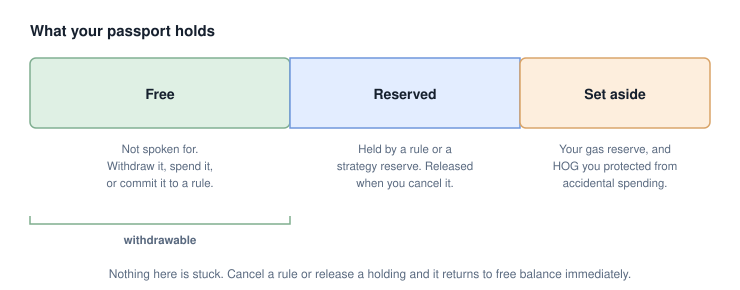

# Custody and control

"Non-custodial" is a claim worth checking rather than accepting. This page sets
out exactly what only you can do, what the automation can do, and the one way
your own balance can be temporarily out of reach.

## What only you can do

Every method on your passport that moves value, or changes what would move
value, checks that the caller is the owner recorded when the passport was
created.

| Action | Who can do it |
|---|---|
| Withdraw ALGO or any asset | Owner only |
| Opt into or out of an asset | Owner only |
| Create, edit, re-fund, or remove a rule | Owner only |
| Open or close a strategy | Owner only |
| Reserve or release a holding | Owner only |
| Swap directly, without automation | Owner only |
| Update the contract to a newer version | Owner only |
| Close the passport and take everything back | Owner only |
| Trigger a rule that has come due | Keeper only |

That last row is the whole of what the automation can do. There is no method
that lets the keeper withdraw, no allowance to grant it, and nothing to revoke
if you stop trusting it. Cancel your rules and it has nothing left to trigger.

## What the keeper cannot do

- It cannot withdraw or transfer your funds to itself or anyone else.
- It cannot create a rule, or edit one you created.
- It cannot opt your passport out of an asset.
- It cannot upgrade, downgrade, or delete your passport.
- It cannot execute a trade that fails your rule's price bound. The bound is
  checked on-chain, against measured balances, after the swap and before the
  transaction is allowed to succeed.

See [Automation](automation.md) for what it is paid and what it does when things
go wrong.

## Free, reserved, and set-aside balance

Your passport's balance is not all withdrawable at any moment, and that is a
feature rather than a limitation.

**Free balance** is anything not spoken for. You can withdraw it, spend it, or
commit it to a new rule at any time.

**Reserved balance** is funds a rule is holding. When you fund a limit order with
500 USDC, that 500 is reserved: it cannot be withdrawn, and no other rule can
spend it. A rule whose funds could be pulled out from under it is not a rule -
it would be an intention that fails at the moment it mattered.

**Set-aside balance** is a holding you have deliberately put out of reach of both
withdrawal and strategies. It is the same mechanism as reserving, but you control
it directly rather than a rule doing it. Two things use it:

- **Your gas reserve.** ALGO set aside for the keeper to reclaim its transaction
  costs from. Automation draws on this and nothing else.
- **Your HOG.** Setting HOG aside stops you accidentally trading or withdrawing
  the balance your routing discount depends on. Note that the discount is
  calculated on your passport's **total** HOG holding, not on the amount set
  aside - setting aside protects the discount, it does not create it. See
  [Fees and costs](../reference/fees-and-costs.md).

**Withdrawals are sized against free balance, not total balance.** If your
passport shows a balance you cannot withdraw, something is holding it. Releasing
it is always available to you: remove the rule, close the strategy, move funds
back out of a rule, or un-set-aside the holding.

## Upgrades happen only if you ask

New versions of the passport contract are published, but nothing pushes one to
you. Applying an update is an owner-signed action like any other. We cannot
upgrade your passport, and neither can the keeper.

Two further protections apply when you do choose to upgrade:

- **Downgrades are refused.** Your passport will not accept a version older than
  the one it is running, even if that older version is a legitimate published
  release.
- **A version that would change how your funds are recorded cannot be applied in
  place.** It requires a new passport and a deliberate move. Your passport
  refuses the in-place path rather than accepting new code that would misread
  what it is holding.

See [Versions and upgrades](../reference/versions-and-upgrades.md).

One consequence worth stating plainly: because upgrades are yours to apply,
published changes - including changes to the fee - reach you only when you choose
to take them. See [Fees and costs](../reference/fees-and-costs.md) for how the
fee rate is captured in practice, which is a little more subtle than that.

## Exit is never gated

Closing your passport, withdrawing everything, and deleting the contract is
always available and is not conditional on anything. It is not gated on a version,
a tier, a fee being paid, or our agreement.

This is deliberate. A contract that can be prevented from closing is one whose
minimum-balance funds nobody ever gets back, and gating the exit would make
leaving cost something. It does not.

See [Closing your passport](../guides/closing-your-passport.md) for the order to
do it in, and the one step that is easy to skip.

## What you are still trusting

Non-custodial is not the same as risk-free, and this page would be dishonest
without saying so.

- The contract holding your funds is proprietary software that has **not been
  audited by a third party**.
- Your price bounds are only as good as the numbers you set. A bound set too
  loosely is protection you do not have.
- Anything that gets you to sign a transaction can do what your signature
  authorises, including a compromised front end.

[Security](../reference/security.md) covers all of this properly.
