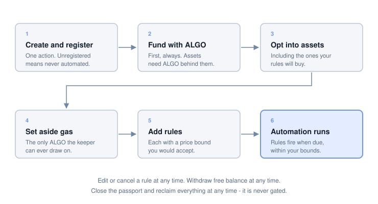

# Getting started

From nothing to a running strategy. Six steps, and the order matters for two of
them.

The app is at [app.liquihog.com](https://app.liquihog.com) and does all of this
for you. Everything below is what is actually happening, so you can follow it
whether you use the app or drive the contracts directly - see
[Developer tools](../reference/developer-tools.md).

## 1. Check what your address can install

The registry decides which version an address may install, and the answer is
readable from chain before you commit to anything. It comes back as one of:

- **the public version (v1.0.2)** - scheduled buys, limit orders, grids and balancers
- **the beta version (v1.1.2)** - all of those plus lending and payments, for allowlisted addresses
- **nothing** - no line is currently open to this address

Ask first rather than finding out from a failed transaction. See
[Tiers](../core/tiers.md).

## 2. Create and register the passport

Creating the contract and registering it are **one action**, even though they are
technically two steps.

Registration is what makes your passport findable by the automation. A passport
that was created but never registered works as a contract - it holds funds, and
you can withdraw from it - but it can never be automated, which is the entire
point of having one. Complete both.

This is also where your address is recorded as the owner. That cannot be changed
afterwards, so create from the address you intend to keep control with.

**One live passport per address.** If you already have one, create will refuse
rather than quietly leaving you with two.

## 3. Fund it with ALGO first

Send ALGO before anything else.

Algorand requires an account to hold a minimum balance, and that requirement
grows with each asset the account holds and each rule it stores. Your passport
pays those out of its own ALGO. If it has none, opting into an asset fails - and
the failure reads like a permissions problem when it is really arithmetic.

So: ALGO first, then assets. See
[Funding and withdrawing](funding-and-withdrawing.md).

## 4. Opt into the assets you will trade

An Algorand account cannot receive an asset it has not opted into, and your
passport is an account. Opt it into each asset you intend to hold or buy -
including the assets your strategies will *acquire*, not just the ones you are
funding with.

Each opt-in raises your passport's minimum balance. That ALGO is not spent; it is
released when you opt back out or close the passport.

Then send the assets. A deposit is an ordinary transfer.

## 5. Set aside ALGO for automation

The keeper reclaims the cost of each trigger from a gas reserve you set aside.
Nothing else in your passport is touched for it.

Set aside more than one trigger's worth. If the reserve empties, your rules stop
being triggered until you top it up - nothing is lost, but nothing runs either.
A strategy that fires often needs a larger reserve than one that fires once.

**If you hold HOG, consider setting that aside too.** It stops you accidentally
trading or withdrawing the balance your routing discount depends on. The discount
is calculated on your passport's total HOG holding rather than on what you set
aside, so this protects the discount rather than creating it. See
[Fees and costs](../reference/fees-and-costs.md).

## 6. Create a strategy

Pick a type, configure it, and fund it. The funds a rule needs are reserved for
it at that point - they leave your free balance and cannot be withdrawn or spent
by anything else until you release them.

See [Strategies](../strategies/README.md) to choose, and the individual pages for
what each one asks you to set:

- [Scheduled buys](../strategies/dca.md)
- [Limit orders](../strategies/limit-orders.md)
- [Grid](../strategies/grid.md) (beta)
- [Balancer](../strategies/balancer.md) (beta)

Every type requires a price bound. Set it as the worst outcome you would actually
accept, not as a prediction - it is the number that stands between you and a bad
fill, and it is enforced on-chain regardless of who triggers the trade.

## After that

Your strategy runs on its own. Things worth checking periodically:

- **Your gas reserve.** The most common reason a strategy quietly stops.
- **Your price bounds.** A bound set months ago describes a market that has moved.
- **A balancer's bounds expiry**, specifically - a balancer stops rebalancing
  when its bounds lapse, by design.

You can edit a running rule's settings, add or remove funds from it, cancel it,
or close the whole strategy at any time. None of that requires our cooperation or
the keeper's.

## Seeing what it has done

Your passport announces every fill on chain: which rule, how much went in, how
much came out, and what the fees were. The app reads that back as your history,
and anything reading the chain can do the same - the record is public and does
not depend on us.

Two things worth knowing about how that record works.

**Fill history lives in transaction logs, not in the contract's state.** Your
passport stores what your rules *are*, not what they have *done* - keeping a
running history on chain would cost minimum balance for ever, for something only
a reader needs. So current state can be read straight from the contract, while
history needs something that indexes past transactions. That is what the app
does for you.

**A deposit is a plain transfer, so nothing on chain says it was a deposit.**
The app attaches a note describing it. If you are moving funds in directly,
consider doing the same - it costs nothing, and it is the difference between a
readable history and a list of anonymous payments.

Current balances, what each rule is holding, and what is free to withdraw are
all live contract state and can be read at any time without an indexer.

## If something is not working

**The strategy is not filling.** Most often the market has not met your bound, or
your gas reserve is empty, or - for a balancer - the bounds have expired. All
three are safe states: nothing has been lost and nothing is stuck.

**A transaction is rejected.** Usually a funding shortfall. Withdrawals and
commitments are limited to *free* balance, so a passport with a balance you
cannot spend is a passport where something is holding it. See
[Custody and control](../core/custody.md).

**Something else.** Open an issue, or ask in the
[Discord](https://discord.gg/a9R4vkXd98). Never share a private key or seed
phrase - nobody from LiquiHog will ask for one, and a transaction id is enough
for us to look something up.
