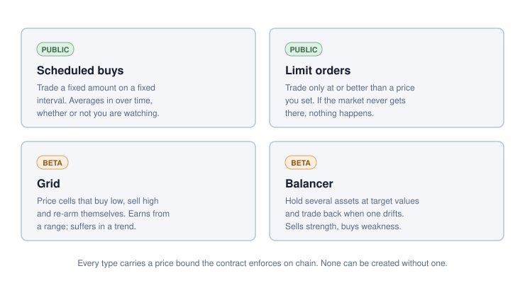

# Strategies

Four things a passport can be told to do. Two are available to everyone; two are
in beta.

## The vocabulary

Two words are used precisely throughout these pages.

A **rule** is one instruction: trade this pair, this much, under these
conditions, and not worse than this price. A rule holds the funds it needs.

A **strategy** is a container for rules of one type. A limit order is a strategy
with a single rule. A grid is a strategy whose rules are its price cells. A
balancer is a strategy whose rules are the assets it holds at target.

This matters when you come to cancel something. Removing one rule leaves the
rest running; closing the strategy releases everything it holds at once.

## The four types

| | Scheduled buys | Limit orders | Grid | Balancer |
|---|---|---|---|---|
| **Tier** | Public | Public | Beta | Beta |
| **Trades when** | An interval has elapsed | The price reaches your target | Price crosses a cell | A holding drifts outside its band |
| **Direction** | One way, repeatedly | One way, once | Both, alternating | Both, as needed |
| **Re-arms itself** | Yes, on the next interval | No | Yes, flips side after each fill | Yes, on the next drift |
| **Price protection** | Minimum output per execution, mandatory | Target output, mandatory | Minimum quote returned per cell | Buy ceiling and sell floor, both mandatory, both expiring |
| **Needs maintenance** | Top up funds | No | Top up, re-space cells | Re-price bounds before they expire |
| **Good for** | Averaging into a position over time | Entering or exiting at a chosen price | Ranging markets | Holding a portfolio at fixed weights |
| **Bad at** | Reacting to price | Anything recurring | Sustained trends | Anything needing fast reaction |

## What they have in common

**Funds are reserved.** Whatever a rule needs is held for it and cannot be
withdrawn or spent by another rule until you release it. See
[Custody and control](../core/custody.md).

**Price protection is enforced on-chain, and it is not optional.** Every type
carries a bound the contract checks against measured balances after the swap.
There is no strategy you can create that has no protection at all - the contract
refuses to create one.

**They are editable while running.** Re-price a rule, add funds to it, or take
funds back out, without cancelling and rebuilding. Editing changes your
settings; it cannot rewind a rule's own progress, so you cannot use an edit to
re-trigger something early or alter what has already filled.

**They fail closed.** A rule whose conditions are not met does not fill. A rule
whose bounds have lapsed stops filling. A passport whose gas reserve has emptied
stops being triggered. In every case the funds stay put and stay yours.

## Choosing between them

If you want to build a position over weeks without watching the market, use
[scheduled buys](dca.md).

If you have a price in mind and want to trade there or not at all, use a
[limit order](limit-orders.md).

If you think a pair will range and you want to earn the oscillation, use a
[grid](grid.md) - and be clear with yourself that a sustained move against you
leaves the grid holding the losing side.

If you want a fixed allocation maintained across several assets, use the
[balancer](balancer.md) - and budget for re-pricing its bounds, which is real
ongoing work rather than a one-off setup.

You can run more than one at a time. They are separate strategies with separate
reserved funds, and they do not interfere with each other - except that they all
draw on the same gas reserve, so top that up with all of them in mind.
